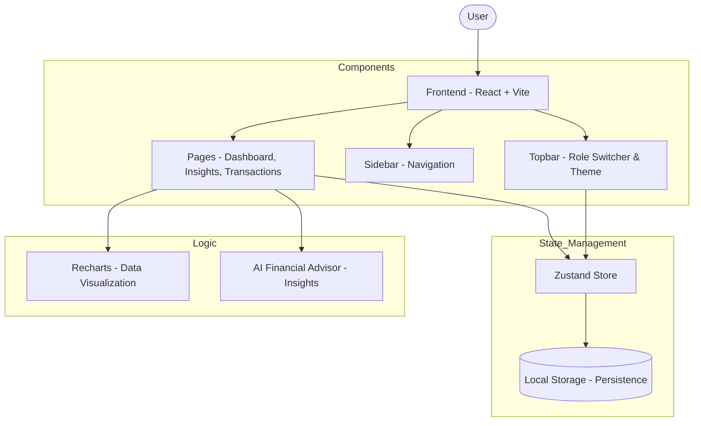

# 🚀 Zorvyn Finance Dashboard

A premium, high-performance finance management dashboard built for the **Finance Dashboard UI Assignment**. This project features a stunning glassmorphic UI, real-time data visualization, and an AI-driven financial advisor.

**GitHub Repository:** [https://github.com/Tanishq-Raj/Zorvyn.git](https://github.com/Tanishq-Raj/Zorvyn.git)  
**Live Demo:** [https://zorvyn.vercel.app](https://zorvyn.vercel.app) (Replace with your actual live link)

---

## 📖 Project Overview

Zorvyn is a financial tracking application designed to help users understand their spending patterns and manage transactions with ease. It emphasizes a **premium user experience** through modern design principles and interactive data storytelling.

### ✅ Core Requirements Implemented

- **📊 Dashboard Overview**:
  - Summary cards for **Total Balance**, **Total Income**, and **Total Expenses**.
  - **Time-Based Visualization**: Area charts showing the net balance trend over time.
  - **Categorical Visualization**: Spending breakdown by category with interactive progress bars.
- **💸 Transactions Management**:
  - Detailed list view with Date, Amount, Category, and Type.
  - **Filtering**: Filter by Type (Income/Expense) and Category.
  - **Search & Sort**: Real-time search by transaction description and sorting by date or amount.
- **🛡️ Role-Based UI (RBAC Simulation)**:
  - **Viewer**: Read-only access to dashboard and transactions.
  - **Admin**: Full permissions to add, edit, and delete transactions.
  - **Custom Switcher**: A premium dropdown in the Topbar to toggle roles instantly.
- **🤖 Insights Section**:
  - Identification of the **Highest Spending Category**.
  - **Monthly Comparison**: Income vs. Expenses bar charts.
  - **Smart Observations**: Automatic feedback on savings rate and month-over-month performance.
- **🧠 State Management**:
  - Powered by **Zustand** for lightweight, predictable global state.
  - **Data Persistence**: Uses `persist` middleware to save state in LocalStorage.

### 🌟 Optional Enhancements Included
- **🌓 Dark Mode**: Built-in theme toggle with persistent user preference.
- **💾 Data Persistence**: Transactions and settings survive page refreshes.
- **🎭 Animations**: Smooth micro-animations using **Framer Motion** and CSS transitions.
- **🎨 Glassmorphism**: A modern, translucent UI aesthetic for a premium feel.

---

## 🛠️ Technical Decisions & Trade-offs

### 1. Zustand for State Management
**Decision:** Used Zustand instead of Redux or Context API.  
**Reasoning:** Zustand offers a much simpler API with zero boilerplate, which was ideal for this assignment. It handles async actions and state persistence (via middleware) natively and efficiently.
**Trade-off:** While Redux is more standard in very large enterprises, Zustand's performance and developer experience were superior for a dashboard project of this scale.

### 2. Vanilla CSS with Modern Variables
**Decision:** Opted for raw CSS with custom properties (CSS Variables) over Tailwind or MUI.  
**Reasoning:** To achieve a highly customized **Glassmorphic** look, vanilla CSS allowed for precise control over `backdrop-filter`, translucency, and custom animations that pre-built libraries often make difficult to override.
**Trade-off:** Required more manual writing of CSS compared to Tailwind utility classes, but resulted in a unique, non-generic visual identity.

### 3. Recharts for Visualization
**Decision:** Integrated Recharts for all data visualizations.  
**Reasoning:** Recharts is built on top of D3 but provides a declarative, React-friendly API. It is highly responsive and fits perfectly with the project's interactive requirements.

### 4. RBAC Simulation
**Decision:** Implemented role switching via a custom global state flag.  
**Reasoning:** Since no backend was required, a global `role` state was the most direct way to demonstrate how the UI adapts to different permissions (e.g., hiding "Add Transaction" buttons for Viewers).

---

## 🚀 Getting Started

### Prerequisites
- Node.js (v18+)
- npm or yarn

### Installation
1. `git clone https://github.com/Tanishq-Raj/Zorvyn.git`
2. `npm install`
3. `npm run dev`

---

## 🛠️ System Architecture

The following flowchart illustrates the high-level architecture and data flow of the Zorvyn Finance Dashboard:

---

## 📂 Project Structure
- `src/components`: UI components (Topbar, Sidebar, Charts, Modals).
- `src/pages`: Main views (Dashboard, Insights, Transactions).
- `src/store`: Zustand store for transactions, roles, and themes.
- `src/data`: Mock data generation and constants.

---

**Built with ❤️ by [Tanishq Raj](https://github.com/Tanishq-Raj)**
